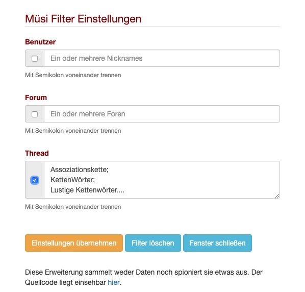
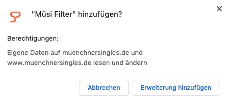
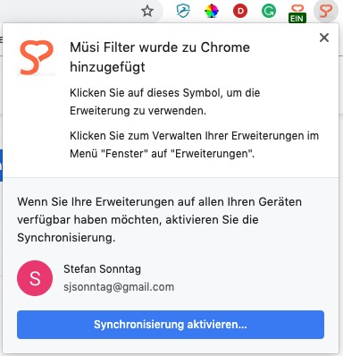
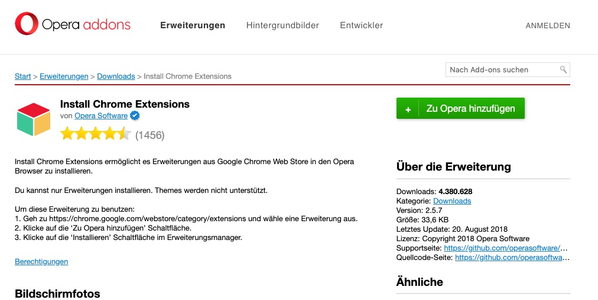
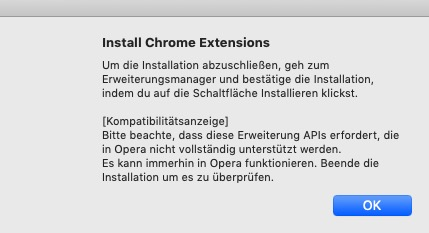
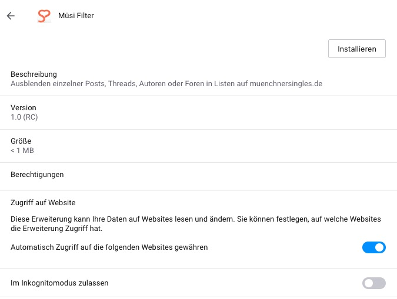
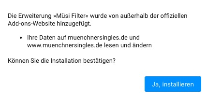
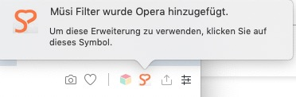

# Müsi Filter
Der Muesi Filter ist eine Erweiterung ("Extension","Add-On") für die Browser von Google ("Chrome"), Mozilla ("Firefox") und Opera ("Opera"). Ich habe sie entwickelt, weil es mir lästig war, in den Forenlisten immer Einträge angezeigt zu bekommen, die mich nicht interessieren (z.B. Smiley, GEHEIM). Die Extension erlaubt es, die Namen von Benutzern, Foren und die Titel von Threads anzugeben, die in den Übersichtslisten nicht mehr angezeigt werden sollen. Der Filter wird vollständig vom Benutzer gesteuert und kann jederzeit ein- und weider ausgeschaltet werden. Sie löscht keine Daten auf den Servern von muenchnersingles.de oder von Eurem Rechner, protokolliert nichts im Hintergrund oder sammelst sonst irgendwelche Daten - sie unterdrückt nur die Anzeige bestimmter User und Posts und das auch nur solange, wie ihr das wollt bzw. eingeschaltet habt! 

## Inhaltsverzeichnis

- [Installation] (#Installation)
- [Einschränkungen] (#Einschränkungen)
- [Sonstiges] (#Sonstiges)
- [Sicherheit] (#Sicherheit)
- [Bedienungstips] (#Bedienungstips)

	

## Installation

### Für Google Chrome
- Falls noch nicht vorhanden: Browser herunterladen und installieren: https://www.google.com/chrome/
- In den Chrome Web Store gehen https://chrome.google.com/webstore nach 'Müsi Filter' suchen und auf 'Hinzufügen' klicken. Es erscheint ein Fenster, in dem Du auf Berechtigungen hingewiesen wirst, die die Extension benötigt, damit sie überhaupt funktionieren kann. 

- Dort auf 'Erweiterung hinzufügen' klicken. Falls Du Bedenken wegen Datensicherheit hast, lies Dir vorher den Abschnitt 'Sicherheit' auf dieser Seite durch.
- Danach erscheint ein weiteres Fenster, in dem Dir mitgeteilt wird, dass die Erweiterung jetzt installiert ist und Du sie verwenden kannst. Über dem Fenster sieht du im Browserbar ein kleines Icon mit dem Logo der Müsis. Den Hinweis zur Synchronisation im unteren Teil des Fensters kannst Du ignorieren und das Fenster schiessen, in dem Du irgendwohin ausserhalb des Fensters klickst.

## Für Opera
Die Installation für Opera ist dieselbe wie für Google Chrome, mit dem kleinen Unterschied, dass man aus Opera heraus nicht den Chrome Web store besuchen kann, da Google es nicht zulässt, dass Nicht-Google Bwowser in den Chrome Web Store gehen. Das macht aber nichts, denn es gibt - genau - eine Opera Extension, die dem Chrome Web Store vorspielt, Opera sei gar kein Opera, sondern ein Chrome Browser :-). Also muss diese Extension zuerst installiert werden, damit ihr danach die Müsi Extension aus dem Chrome Web Store laden könnt

- Falls noch nicht vorhanden: Browser herunterladen und installieren: http://www.opera.com/de

- Auf folgende Seite gehen: https://addons.opera.com/de/extensions/details/install-chrome-extensions/ und dort die angezeigte Erweiterung installieren, in dem Du auf 'Zu Opera hinzufügen' klickst
 
 

 - Es erscheint ein Hinweisfenster, dass die Erweiterung installiert ist
 

- Danach kann es mit der eigentlichen Installation der Müsi Erweiterung losgehen. 
- Dazu in den Chrome Web Store gehen https://chrome.google.com/webstore und dort nach 'Müsi Filter' suchen und auf 'Hinzufügen' klicken. Es erscheint ein Fenster, dass dir im Wesentlichen sagt, dass Du eine Chrome Extension in Opera installieren willst (was ja eigentlich nicht geht, s.o.) und es sein kann, dass dies Erweiterung ggf nicht ganz korrekt läuft. Tut sie aber :-) Also auf OK klicken und weitermachen

 

- Danach wirst Du eine Seite geleitet, von der Du den Müsi Filter herunterladen und installieren kannst. Dazu auf der Seite auf 'Installieren' klicken

 

- Es erscheint wie bei der Installation unter Chrome der Sicherheitshinweis. Dort 'Ja, Installieren' klicken. 

 

 -Last but not leadt siehst du dann ein Fenster, in dem dir bestätigt wird, dass der Müsi Filter installiert wurde. Ein Icon mit dem Müsi Logo ist im Browser Bar rechts oben zu sehen

  

-- Mozilla Firefox https://www.mozilla.org/de/firefox/new/

- Folgende Seite aufrufen: https://github.com/stefansonntag/filter/blob/master/Muesi.crx und per Klick auf den Download Button die Datei auf den eigenen Rechner herunterladen

- In den Ordner für Downloads gehen, mit der rechten Maustaste auf die zuvor heruntergeladene Datei muesi.crx klicken und in dem daraufhin sich öffnendem Menu die Option "Öffnen mit" anklicken, Google Chrome auswählen und dann wird die Extension installiert. Alternativ könnt ihr "chrome://extensions/" in die Addresszeile von Chrome eingeben und dann auf die sich öffnene Seite die zuvor herunter gelandene Datei "muesi.crx" ziehen. Falls Ihr die Extension wieder löschen wollt: einfach "chrome://extensions/" in die Addresszeile von Chrome eingeben und dann bei Muesi Filter auf "Entfernen" klicken. 

## Einschränkungen

- Die Extension läuft nur auf Laptops bzw Desktop PC / Mac's, sie läuft nicht auf iPhones / iPad, oder irgendwelchen Geräten unter Andriod (Smartphone, Tablet). Das liegt daran, dass Google die Funktionalität von Chrome Extensions ausschliesslich auf Desktop Rechnern anbietet

- Es ist möglich, dass die Paginierung manchmal etwas komisch aussieht. Wenn ihr z.B. unter "Neue Beiträge" geht und beispielsweise die Plauderecke unterdrückt, dort aber auf der ersten Seite ungefiltert bis auf einen Eintrag nur Posts aus der Plauderecke stehen, dann sieht Eure Anzeige so aus, dass auf Eurer Seite 1 nur 1 Eintrag steht, nämlich der einzige, der nicht gefiltert wird. Das liegt daran, dass die Erweiterung nur im Browser läuft und keine Daten serverseitig modifizieren kann, also auch nicht die Paginierung auf Basis der gefilterten Posts berechnen berechnen kann. Gleiches gilt für die abwechselnde Schattierung in den Listen: normalerweise sehr ihr dort die Posts abwechselnd grau und weiß hinterlegt. Wenn ihr einen Eintrag filtert, dann kann es also passieren, dass künftig zwei oder mehr aufeinander angezeigte Posts grau bzw weiß hinterlangeigt werde und nicht mehr abwechselnd.

- Es werden zwar Posts unterdrückt, nicht aber deren Zitate.  

- Wenn ihr die Filtereinstellungen das erste Mal nach der Installation aufruft, dann kann es sein, dass in den Eingabefelder "undefined" steht. Das ist nicht weiter schlimm, ihr könnt die Einträge einfach überschreiben bzw löschen. Das ist nur meiner Faulheit anzulasten, alle Möglichkeiten durchzutesten, in denen es zu nicht sauber initialisierten Variable kommen kann.

- Wenn Ihr auf "Neue Beiträge" seid, der gelbe Eintrag "Neue Beträge wurden geschrieben" erscheint und ihr klickt darauf, dann seht ihr den Eintrag unabhängig davon, ob ihr ihn gefiltert habt oder nicht. Um ihn auszublenden müsst ihr die Seite übrr den Browser neu laden. 

## Sonstiges

Wer mitentwickeln möchte, immer gerne. Einfach das repo forken und los gehts ...

## Sicherheit

Die Extension ermittelt keine anderen Daten als für den Zweck, für den sie geschrieben wurde. Es ist kein Trojaner oder sonst etwas. Ich habe den Source Code mit Absicht so weit wie es programmiertechnisch sinnvoll ist im Klartext geschrieben, also sprechende Variablennamen, Kommentare im Source Code, keine Verwendung von uglify.js oder ähnlichem, damit alles nachvollziehbar ist. Wenn die Zeit es erlaubt, erstelle ich auch noch einen Architekturplan, der erklärt, was genau zu welchem Zeitpunkt passiert. Das hilft mir, meine Gedanken genauer zu strukturieren und gibt Euch hoffentlich das Vertrauen, dass hinter der Extension kein Teufelszeugs steckt. Könnte man ja nachvollziehbarerweise meinen, weil sie im Browser der bösen Tante Google läuft ;-)

Für die Web Entwickler unter euch: die Extension modifiziert das DOM und löscht mit Hilfe von jQuery ein paar HTML Tabellen, also absolute Standards, die seit Jahren angewerdet werden. 

Um sich den Source Code der installerten Erweiterung auf cdem eigenen Rechner anzusehen (denn die crx datei zum installieren könnte ja theoretisch etwas ganz Anderes enthalten als der im repo veröffentlichte Source Code, z.B einen Trojaner): https://gist.github.com/paulirish/78d6c1406c901be02c2d beschreibt, wie man das machen kann

## Bedienungstips

- Man kann eine Tastenkkombination festlegen, die das Filterfenster aufruft, so dass man nicht immer mit der Maus auf das kleine Icon zielen muss. Dazu in die Verwaltung von Extensions ("chrome://extensions") gehen, auf das Menu links klicken (die drei waagerechten Striche lins oben), dann Tastenkombination und dann in das Feld "tastenkombination" gehen und die Tastaturfolge drücken, beu mit z.B. Control-M (Command M auf dem Mac) 

- Wenn der Filter aktiv ist, also Einträge in den Listen unterdrückt, dann seht ihr auf dem Icon "EIN" geschrieben. Was "AUS" bedeutet, ist hoffentlicvh klar :-). EIN ist der Filter immer dann, wenn mindestens eines der 3 Häkchen gesetzt ist und in einem Feld, dessen Häkchen gesetzt ist, mindestens 1 Filterbegriff steht (Minimum 1 Zeichen)

- Der Filter unterscheidet Gross- und Kleinschreibung. Wenn Ihr also den Thread "Guten Morgen" herausfiltern wollt, müsst ihr es genau so schreiben; "Guten Morgen" wird zu keinem Ergebnis führen. Was aber funktioniert, ist dass nur der ersten Buchstaben dessen, was gefiltert werden soll, angegeben werden. Wenn ihr also nach "Guten Morgen" filtert, werden auch Threads wie "Guten Morgen....","Guten Morgen allerseits" usw. in der Anzeige unterdrückt. Für Benutzernamen gilt die gleiche Funktionsweise.

- Die einfachste Art, wie man Benutzername und/oder Thread Titel ohne Tippfehler in die Felder einträgt ist, in den Listen (z.B. in Neue Beiträge, geht aber auch jede andere Liste) mit der Maus über den Benutzernamen bzw Threadtitel zu fahren, dann recht Maustaste und "kopieren" (nicht Link Adresse Kopieren!), dann das Filterfenster öffnen und den Inhalt in das entsprechende Feld hineinzukopieren, wiederum mit rchter Maustates und dann "Einfügen" auswählen
	
