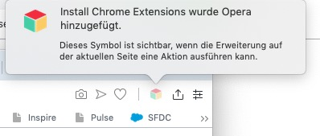

# Müsi Filter
Der Muesi Filter ist eine Erweiterung ("Extension","Add-On") für die Browser von Google ("Chrome"), Mozilla ("Firefox") und Opera ("Opera"). Ich habe sie entwickelt, weil es mir lästig war, in den Forenlisten immer Einträge angezeigt zu bekommen, die mich nicht interessieren (z.B. Smiley, GEHEIM). Die Extension erlaubt es, die Namen von Benutzern, Foren und die Titel von Threads anzugeben, die in den Übersichtslisten nicht mehr angezeigt werden sollen. Der Filter wird vollständig vom Benutzer gesteuert und kann jederzeit ein- und wieder ausgeschaltet werden. Sie löscht keine Daten auf den Servern von muenchnersingles.de oder von Eurem Rechner, protokolliert nichts im Hintergrund oder sammelst sonst irgendwelche Daten - sie unterdrückt nur die Anzeige bestimmter User und Posts und das auch nur solange, wie ihr das wollt bzw. eingeschaltet habt! 

	

## Installation

### Für Google Chrome

1) Falls noch nicht vorhanden: Browser herunterladen und installieren: https://www.google.com/chrome/

2) In den Chrome Web Store gehen https://chrome.google.com/webstore/detail/müsi-filter/fdhoepcaknoijkocinkjodileckhopno und auf 'Hinzufügen' klicken. Es erscheint ein Fenster, in dem Du auf Berechtigungen hingewiesen wirst, die die Extension benötigt, damit sie überhaupt funktionieren kann. 

Dort auf 'Erweiterung hinzufügen' klicken. Falls Du Bedenken wegen Datensicherheit hast, lies Dir vorher den Abschnitt 'Sicherheit' auf dieser Seite durch.

Danach erscheint ein weiteres Fenster, in dem Dir mitgeteilt wird, dass die Erweiterung jetzt installiert ist und Du sie verwenden kannst. Über dem Fenster sieht du im Browserbar ein kleines Icon mit dem Logo der Müsis. Den Hinweis zur Synchronisation im unteren Teil des Fensters kannst Du ignorieren und das Fenster schliessen, in dem Du irgendwo ausserhalb des Fensters klickst.

### Für Opera

Die Installation für Opera ist dieselbe wie für Google Chrome, mit dem kleinen Unterschied, dass man aus Opera heraus nichts aus dem Chrome Web Store installieren kann, da Google es nicht zulässt, dass Nicht-Google Browser sich im Chrome Web Store bedienen. Das macht aber nichts, denn es gibt kluge Freizeitentwickler, die - genau - eine Opera Extension geschrieben haben, welhe dem Chrome Web Store vorspielt, Opera sei gar kein Opera, sondern ein Chrome Browser. Genau das, was wir brauchen! Also muss diese Extension zuerst installiert werden, damit ihr danach die Müsi Extension aus dem Chrome Web Store laden könnt.

1) Falls noch nicht vorhanden: Browser herunterladen und installieren: http://www.opera.com/de

2) Auf folgende Seite gehen: https://addons.opera.com/de/extensions/details/install-chrome-extensions/ und dort die angezeigte Erweiterung installieren, in dem Du auf 'Zu Opera hinzufügen' klickst

 

Es erscheint ein Hinweisfenster, dass die Erweiterung installiert ist

3) Danach kann es mit der eigentlichen Installation der Müsi Erweiterung losgehen. Dazu in den Chrome Web Store gehen https://chrome.google.com/webstore/detail/müsi-filter/fdhoepcaknoijkocinkjodileckhopno und auf 'Hinzufügen' klicken. Es erscheint ein Fenster, dass dir im Wesentlichen sagt, dass Du eine Chrome Extension in Opera installieren willst (was ja eigentlich nicht geht, s.o.) und es daher sein kann, dass die Erweiterung vielleicht nicht ganz korrekt läuft. Tut sie aber, das weiss ich weil ich sie geschrieben habe und Lennox sie getestet hat :-) Also auf 'OK' klicken und weitermachen

Anschließend wirst Du auf eine Seite geleitet, von der Du den Müsi Filter herunterladen und installieren kannst. Dazu auf der Seite auf 'Installieren' klicken

Es erscheint wie bei der Installation unter Chrome der Sicherheitshinweis. Dort 'Ja, Installieren' klicken. 

Last but not least siehst du dann ein Fenster, in dem dir bestätigt wird, dass der Müsi Filter installiert wurde. Ein Icon mit dem Müsi Logo ist im Browser Bar rechts oben zu sehen.

### Für Firefox

1) Falls noch nicht vorhanden: Browser herunterladen und installieren: https://www.mozilla.org/de/firefox/new/

2) Den Mozilla Add On Store besuchen https://addons.mozilla.org/de/firefox/addon/müsi-filter/ und auf 'Zu Firefox hinzufügen klicken. Es erscheint ein Fenster, in dem Du auf Berechtigungen hingewiesen wirst, die die Extension benötigt, damit sie überhaupt funktionieren kann. Dort 'Ja' auswählen.

Anschliessend wird ein Fenster angezeigt, dass die Extension installiert ist. Ein Icon mit dem Müsi Logo ist im Browser Bar rechts oben zu sehen

## Einschränkungen

Die Extension läuft nur auf Laptops bzw Desktop PC / Mac's, sie läuft nicht auf iPhones / iPad oder irgendwelchen Geräten unter Android (Smartphone, Tablet). Das liegt daran, dass die Browerhersteller die Funktionalität von Extensions nur auf Desktop Rechnern anbieten. 
Update: Laut https://support.mozilla.org/de/kb/add-ons-finden-und-installieren-firefox-android funktionieren Extensions in Firefox auf Android Geräten. Da ich aber keines besitze, kann ich es nicht testen.

Es ist möglich, dass die Paginierung manchmal etwas komisch aussieht. Das liegt daran, dass die Erweiterung nur im Browser läuft und keine Daten serverseitig modifiziert, also auch nicht die Paginierung auf Basis der gefilterten Posts berechnen kann, sondern die Paginierung der ungefilterten Listen vom Server übernimmt. Gleiches gilt für die abwechselnde Schattierung in den Listen - die wird ebenfalls auf dem Server vorberechnet und dann an den Browser geschickt: Normalerweise sehr ihr die Posts abwechselnd grau und weiß hinterlegt. Wenn ihr einen Eintrag filtert, dann kann es passieren, dass zwei hintereinander angezeigte Posts gleichermaßen grau bzw weiß hinterlegt sind und nicht mehr abwechselnd.

Es werden zwar einzelne Posts unterdrückt, nicht aber deren Zitate.   

Wenn ihr die Filtereinstellungen das erste Mal nach der Installation aufruft,  kann es sein, dass in den Eingabefeldern "undefined" steht. Das ist nicht weiter schlimm, ihr könnt die Einträge einfach überschreiben bzw löschen. Dieser Effekt ist nur meiner Faulheit anzulasten, alle Möglichkeiten durchzutesten, in denen es zu nicht sauber initialisierten Variablen kommen kann.

Wenn Ihr auf "Neue Beiträge" seid, der gelbe Balken "Neue Beträge wurden geschrieben" über der Liste erscheint und ihr klickt darauf, dann seht ihr den Post - unabhängig davon, ob ihr ihn gefiltert habt oder nicht. Um ihn auszublenden müsst ihr die Seite über den Browser neu laden, etwa mit CTRL-R bzw Command-R auf dem Mac, klappt supergut und mache ich seitdem nur noch so (geht auch schneller als mit der Maus zu zielen). 

In Firefox bewirkt ein Klicken auf "Einstellungen übernehmen" kein automatisches Neuladen der Seite. Damit die Filter angewendet werden , müsst ihr die Seite manuell neu laden (über das Menu, Tastatur, das Reload Icon oder auf einen der Links auf den Müsi Seiten). Theoretisch sollte der Code zwar laufen laut der Entwickler Dokumentation, faktisch tut er es aber nicht, zumindest nicht bei mir. Und bis ich mir zurechtgefriemelt habe, wie ich eine Firefox-spezifische Funktion in javascript bauen kann und sie teste, dauert es. Will sagen, es dauert vermutlich auch etwas länger, siehe den Punkt Faulheit weiter oben.

## Sicherheit

Die Extension ermittelt keine anderen Daten als für den Zweck, für den ich sie geschrieben habe. Es ist kein Trojaner oder sonst etwas. Ich habe den Source Code daher hier auf github.com veröffentlicht, so dass jeder hineinsehen kann, was ich programmiert habe. Ich habe mit Absicht und so weit wie es programmiertechnisch sinnvoll ist im Klartext entwickelt, also sprechende Variablennamen, viele Kommentare im Source Code, keine kryptischen Kurzschreibweisen (die in javascript ganz wundervoll verwirrend sein können), keine Verwendung von uglify.js, minify.js oder Ähnlichem (Obfuscation im Fachjargon). Klar muss mal ein wenig Code lesen können, aber damit sollte alles nachvollziehsein, es ist ja keine systemprogrammierung, sondern nur simple Webseiten-Codierung. Wenn die Zeit es erlaubt, erstelle ich irgendwann auch noch einen Architekturplan, der erklärt, was genau zu welchem Zeitpunkt passiert. Das hilft mir, meine Gedanken genauer zu strukturieren und gibt Euch hoffentlich das Vertrauen, dass hinter der Extension kein Teufelszeugs steckt. 

Für die Web Entwickler unter euch: die Extension sucht mit JQuery Selectoren die Zellen in HTML Tabellen, in denen Eure Begriffe vorkommen (entweder im <TD> Tag direkt oder in einem eingebetteten <A> Tag) und und löscht dann die ganze Zeile (<TR>), modifiziert also das Document Object Model (DOM). DOM Modifikation mittels JQuery ist eine Standard Vorgehensweise, die seit 10 Jahren oder länger bereits angewendet wird. 

Für die Nicht Web Entwickler: Ihr fordert im Browser eine Seite von den muenchnersingles an. Der Server sendet diese an den Browser. Bevor der Browser die Seite anzeigt, hakt sich die Extension ein und löscht die Einträge aus der Seite heraus, die ihr nicht sehen wollt. Sie arbeitet nur im Browser und löscht/modifiziert weder Daten auf den Servern von muenchnersingles.de noch solche, die auf Eurem Rechner gespeichert sind. Sie protokolliert auch nichts im Hintergrund oder spioniert sonst irgendwelche Daten aus - sie unterdrückt nur die Anzeige bestimmter User und Posts und das auch nur solange, wie ihr das wollt bzw. eingeschaltet habt!  

Meinen Kindern habe das früher so erklärt: Bei den Müsis (zugegeben, es ging damals um andere Web Seiten) gibt es ein seeehr wertvolles Buch. Das geben die natürlich niiiemals aus den Händen, ist ja klar. Aber sie erlauben es Euch, in dem Buch zu lesen. Wenn ihr also eine Seite aus dem Buch lesen wollt, sagt ihr einem Bibliothekar, welches Kapitel aus dem Buch ihr lesen wollt. Der Bibliothekar weiss natürlich, wo das Buch steht und auf welchen Seiten sich Kapitel befindet, und sagt einem Praktikanten, dass er für euch eine Kopie der Seiten anfertigen soll, denn das Original kann er nicht aus den Händen geben, das ist ja viel zu wertvoll. Aber warum ein Praktikant, warum macht der Bibliothekar das nicht selber? Hinter Euch steht bereits der Nächste in der Schlange, der auch etwas lesen möchte, aus einem anderen, aber mindestens ebenso wertvollen Buch. Jetzt könnt ihr euch sicher vorstellen, dass ihr eeewig warten müsstet, wenn der Bibliothekar jedesmal selber loslaufen würde und mal aus dem einen, mal aus dem anderen Buch die Seiten kopiert. Deswegen hat der Bibliothekar mehrere Praktikanten, die er losschickt und ihnen sagt, was sie rauskopieren sollen. So müsst ihr also nicht so lange warten, bis ihr endlich an der Reihe seit und dem Bibliothekar sagen könnt, was ihr lesen möchtet. Und in der Zwischenzeit flitzen die Praktikanten durch die Blibliothek, machen Kopien und bringen sie zu euch. 
Soweit funktioniert jede Web Seite im Kinderjargon, aber jetzt kommts, hier ist der Müsi-spezifische Trick: 
Bevor der Praktikant zu euch kommt, hält ihn sein Kumpel hinter einem Regal auf, sagt "Hey, zeig mir mal, was du da hast!" und reisst ihm die Kopie aus den Händen. Er liest sie rasch durch und denkt sich "Nö, der Absatz da ist ja doof, der gefällt mir nicht", schwärzt ihn schnell aus und drückt dann dem Praktikanten die Seite wieder in die Hand. Der Praktikant aber hat soviel zu tun, dass er gar nicht weiter hinguckt, was sein Kumpel auf der Seite verändert hat und gibt euch deswegen dann die teils geschwärzte Kopie ...

## Bedienungstips

Man kann eine Tastenkombination festlegen, die das Filterfenster aufruft, so dass man nicht immer mit der Maus auf das kleine Icon zielen muss. Dazu in die Verwaltung von Extensions ("chrome://extensions") gehen, auf das Menu links klicken (die drei waagerechten Striche lins oben), dann Tastenkombination und dann in das Feld "Tastenkombination" gehen und die Tastenfolge drücken, bei mir z.B. Control-M (Command M auf dem Mac). In Opera gibt man "opera://settings/keyboardShortcuts" in die Addresszeile ein, scrollt nach ganz unten und kann dann ebenfalls eine Tastenkombination angeben. In Firefox gint es sowas sicher auch, aber ich weiß nicht wie und wo :-)

Wenn der Filter aktiv ist, also Einträge in den Listen unterdrückt, dann seht ihr auf dem Icon "EIN" geschrieben. Was "AUS" bedeutet, ist hoffentlich klar ;-). EIN ist der Filter immer dann, wenn mindestens eines der 3 Häkchen gesetzt ist und in einem Feld, dessen Häkchen gesetzt ist, mindestens 1 Filterbegriff steht (Minimum 1 Zeichen)

Der Filter unterscheidet Groß- und Kleinschreibung. Wenn Ihr also den Thread "Guten Morgen" herausfiltern wollt, müsst ihr es genau so schreiben; "GUTEN Morgen" wird zu keinem Ergebnis führen. Was aber funktioniert, ist dass nur die ersten Buchstaben dessen, was gefiltert werden soll, angegeben werden. Wenn ihr also nach "Guten Morgen" filtert, werden auch Threads wie "Guten Morgen....","Guten Morgen allerseits" usw. in der Anzeige unterdrückt. Für Benutzernamen gilt die gleiche Funktionsweise.

Die einfachste Art, wie man Benutzername und/oder Thread Titel ohne Tippfehler in die Felder eintragen kann ist, in den Listen mit der Maus über den Benutzernamen bzw Threadtitel zu fahren, dann rechte Maustaste klicken und "Kopieren" (nicht: "Link Adresse kopieren"!) aus dem Kontextmenu auswählen, dann das Filterfenster öffnen und den Inhalt in das entsprechende Feld einfügen, wiederum mit rechter Maustaste und dann "Einfügen" auswählen
	
## Sonstiges

Wer mitentwickeln möchte, immer gerne. Einfach das repo forken und los gehts ...